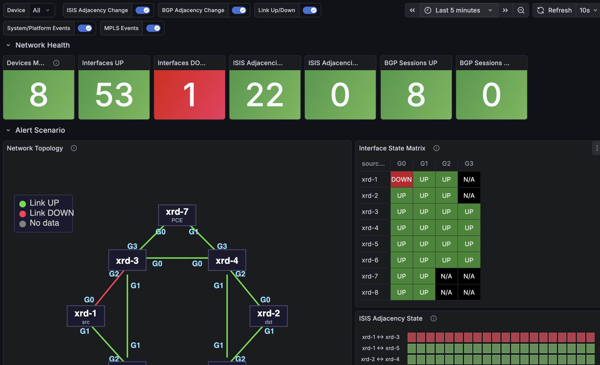
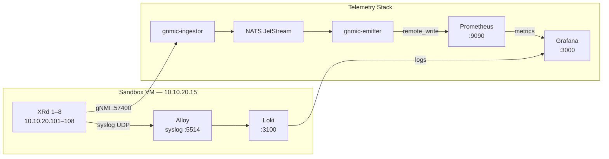
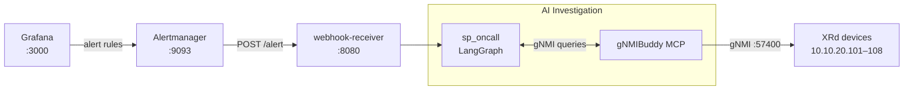

# XRd Segment Routing Telemetry Stack

Streaming telemetry and AI-assisted alerting for a Cisco IOS-XR Segment Routing topology, built for Cisco Live 2026.

## What this does

Eight XRd routers running IOS-XR 25.3.1 stream gNMI telemetry (interfaces, ISIS adjacencies, BGP sessions, SR-TE paths) into a Grafana observability stack. When an alert fires — for example, an interface goes down and cascades into ISIS adjacency losses — a webhook triggers an AI agent ([sp_oncall](https://github.com/jillesca/sp_oncall)) that investigates the network state via [gNMIBuddy](https://github.com/jillesca/gNMIBuddy) and reports root cause.

```text
XRd 1-8 ──gNMI──► gnmic-ingestor ──► NATS JetStream ──► gnmic-emitter ──► Prometheus
XRd 1-8 ──syslog──► Alloy (VM) ──► Loki
Prometheus + Loki ──► Grafana ──► alert rules ──► webhook ──► sp_oncall (LangGraph)
```



See [docs/dashboard-img.md](docs/dashboard-img.md) for more screenshots of the dashboards and alerts.

## Architecture

### Telemetry pipeline



### Alert and AI response



## Topology

```text
             xrd-7 (PCE)
           /             \
       xrd-3 --------- xrd-4
       / |                 | \
── xrd-1  |                 |  xrd-2 ──
       \ |                 | /
       xrd-5 --------- xrd-6
           \             /
            xrd-8 (vRR)
```

| Device | Role      | Management IP | gNMI Port |
| ------ | --------- | ------------- | --------- |
| xrd-1  | PE / Edge | 10.10.20.101  | 57400     |
| xrd-2  | PE / Edge | 10.10.20.102  | 57400     |
| xrd-3  | P / Core  | 10.10.20.103  | 57400     |
| xrd-4  | P / Core  | 10.10.20.104  | 57400     |
| xrd-5  | P / Core  | 10.10.20.105  | 57400     |
| xrd-6  | P / Core  | 10.10.20.106  | 57400     |
| xrd-7  | PCE       | 10.10.20.107  | 57400     |
| xrd-8  | vRR       | 10.10.20.108  | 57400     |

XRd runs on a [Cisco DevNet sandbox](https://devnetsandbox.cisco.com/DevNet) VM (`10.10.20.15`) via Docker macvlan (`segment-routing_mgmt`).

## Stack components

| Container          | Purpose                                      |
| ------------------ | -------------------------------------------- |
| `gnmic-ingestor`   | gNMI subscriptions → NATS JetStream          |
| `gnmic-emitter`    | NATS → Prometheus remote_write               |
| `nats`             | JetStream message bus                        |
| `prometheus`       | Metrics storage + alert evaluation           |
| `alertmanager`     | Alert routing → webhook contact point        |
| `grafana`          | Dashboards + unified alerting                |
| `webhook-receiver` | FastAPI receiver → sp_oncall LangGraph agent |
| `alloy`            | Syslog ingestion (VM only) → Loki            |
| `loki`             | Log storage (VM only)                        |

## Access

URLs are for split mode (running on laptop). In full-VM mode replace `localhost` with `10.10.20.12` for Grafana and `10.10.20.15` for everything else.

| Container          | URL                                | Notes                                      |
| ------------------ | ---------------------------------- | ------------------------------------------ |
| `grafana`          | <http://localhost:3000>            | Login: `admin` / `grafana`                 |
| `prometheus`       | <http://localhost:9090>            | Query UI + Targets at `/targets`           |
| `alertmanager`     | <http://localhost:9093>            | Active alerts and silences                 |
| `nats`             | <http://localhost:8222>            | Server info; `/jsz` for JetStream details  |
| `webhook-receiver` | <http://localhost:8080/docs>       | FastAPI interactive docs; `/health` status |
| `alloy`            | <http://10.10.20.11:12345>         | Alloy debug UI (VM only)                   |
| `nats-exporter`    | <http://localhost:7777/metrics>    | Prometheus scrape endpoint (text)          |
| `gnmic-ingestor`   | <http://localhost:9804/metrics>    | gnmic metrics endpoint (text)              |
| `gnmic-emitter`    | <http://localhost:9806/metrics>    | gnmic metrics endpoint (text)              |
| `loki`             | <<http://10.10.20.15:3100/ready> > | API only — query via Grafana               |

## Deployment

Alloy and Loki must run on the VM — they receive syslog from XRd via macvlan and cannot run on a laptop.

### Split mode — recommended

Alloy + Loki run on the VM (close to XRd, reachable via macvlan). Grafana + Prometheus + NATS + gnmic run on the laptop.

```bash
# 1. Deploy Alloy + Loki to the VM
make vm-deploy

# 2. Start the rest on the laptop
LOKI_URL=http://10.10.20.15:3100 make up
```

### Full-VM mode — optional

Runs everything on the VM. Requires additional network and IP configuration that is environment-specific. Check [`.env.example`](.env.example) for the variables you need to set (`ALLOY_MACVLAN_IP`, `GRAFANA_MACVLAN_IP`) and ensure the `segment-routing_mgmt` macvlan network exists on the host.

```bash
make up-vm
```

See [docs/deployment.md](docs/deployment.md) for prerequisites and step-by-step instructions.

```bash
make help   # list all targets
```

## Configure XRd syslog destination

```bash
ANSIBLE_HOST_KEY_CHECKING=False \
uvx --from "ansible-core==2.19.2" --with "paramiko,ansible" \
ansible-playbook ansible-helper/xrd_apply_config.yaml -i ansible-helper/hosts
```

## Related projects

| Project     | Repo                                                                              |
| ----------- | --------------------------------------------------------------------------------- |
| gNMIBuddy   | <https://github.com/jillesca/gNMIBuddy>                                           |
| sp_oncall   | <https://github.com/jillesca/sp_oncall>                                           |
| XRd Sandbox | <https://github.com/CiscoDevNet/XRd-Sandbox/tree/main/topologies/segment-routing> |

## Acknowledgements

This project is built on top of [gnp-stack](https://github.com/gnp-stack/gnp-stack) — an excellent open-source gNMIc + NATS + Prometheus + Grafana telemetry stack. The original project provides a great foundation for vendor-agnostic streaming telemetry; this repo extends it for Cisco XRd / IOS-XR, adds Loki log correlation, Grafana alerting, and an AI-driven investigation agent.

The network topology on the grafana dashboard is inspired by the [Nokia EDA Telemetry Lab](https://github.com/eda-labs/eda-telemetry-lab) that has some nice visualizations of a DC Fabric.
